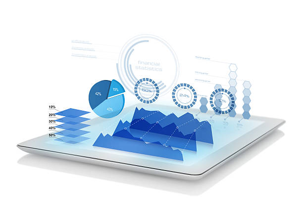

# data-visualization-using-flask-project2

**Data Selection and Sources:**

- US county and states level 5 years census dataset through
 an API call.
 - US county and states level education attainment dataset from
 ‘Economic Research Services’ 
(USDA ERS)
[Census Data](https://www.ers.usda.gov/data-products/county-level-data-sets/download-data/)

- The fips code dataset. 

**Requirement Accomplished:**

The following specification required for the project are utilized and fulfilled:
- Python Flask - powered API
- HTML/CSS
- Javascript
- PostgreSQL database
- Leaflet - Javascript Library
- Chart.js - Javascript Library
- Plotly - Javascript graphing Library
- User-driven interaction (e.g., menus, dropdowns, and text boxes).
- A dashboard page with multiple charts that updates from the same data.
- A server that performs multiple manipulations on data in a database prior to visualization.

**Data Fetching and Cleaning Steps (ETL):**

- The dependencies  imported are: Pandas, request, Census, api_key
In file ‘census_2019_county_apidata.ipynb’, 
the census dataset is retrieved through the API call.

- The file is saved as ‘census_us_county_output.csv’
Next, the data cleaning is performed in the file, 
‘data_cleaning.ipynb’

- Three csv files are imported in ‘data_cleaning.ipynb’
for cleaning and preparing for the PostgreSQL database:

- "resources/census_us_county_output.csv"
- "resources/ers_usda_education.csv"
- "resources/county_fips.csv"

- In Leaflet file,  ‘leaflet_data_cleaning.ipynb’ , data cleaning
 is performed for the leaflet map.

Data is read into Pandas dataframe and following steps are 
performed for the cleaning process:

- Resetting the index.
- Renaming the columns.
- Dropping the NULL rows and columns.
- Slicing extra strings in the column values like ‘county’.
- Stripping the blanks and commas.
- Splitting the column in the ‘census’ dataset.
- Dropping the duplicates.
- Removing the extra columns.
- Sorting the data frames based on state and county.
- Renaming the columns for preparing for merge.
- Merging and splitting of data frames is performed to
 have a primary key in each dataset to make it ready 
for the relational database.

**Designing the Relational Database For PostgreSQL:**

- Relational database design 
diagram is drawn using an online 
tool ‘Quick DBD’. 

- Primary and Foreign keys are assigned
and tables are created.

- Finally, datasets are imported in
PostgeSQL database.

- Queries are performed for testing and
 views are created here.

**SQLAlchemy - The Python SQL Toolkit**

- The SQLAlchemy analysis is performed
 by importing the dependencies and 
connecting to the database engine. 
This allows the access of the database 
in Python environment (Jupyter notebook).

**Flask Application, Javascript, HTML & CSS**

A dashboard is designed using the following files:
- main.py -- dependencies are imported, routes are created, and queries are added.

- app.js -- using d3.js for processing the data, and plotly.js and chart.js libraries are used for plotting charts.

- Index.html -- source links are added, dashboard is designed using these html files.

- about.html
- base.html
- home.html
- plotly.html
- leaflet.html

**Dashboard Presentation**

**Storytelling through Data:**

**Scatter Plot:**

This chart is responsive, representing counties 
of single state each time.

There is a direct correlation between the per capita 
Income and the percentage of bachelor’s degree 
And higher.

As the per capita income goes up, so does the 
percentage of bachelor’s degree and higher.

**Line Plot:**

- Here every state’s population, poverty count 
and education data is normalized by dividing the 
values with 100,000, so that we can compare
one state to the other.

- -There is a inverse relationship between the 
Poverty count and average bachelor’s degree 
and higher, meaning, higher the poverty 
count, lower the education achievement.

- The line plot is not at the county level, 
because there is not enough data to show
 the inverse relationship at the county level.

**Bar Plot:**

- This chart is for comparison
Of the four categories of 
education between the states.

- I choose to show the total 
of each degree, where when 
hover over, can see the 
difference in numbers.

- Wider the red portion, means
higher the level of achievement.

**Leaflet Map:**

- It’s the visual representation
of the poverty level in each
state.

